<h1 align="center">Movie Addicts</h1>

  
  
 

 
 A simple project to demonstrate an approach based on MVI + Clean architecture and modularization based on features and layers
 
 
 
 
 ## Tech stack & Open-source libraries
 - Minimum SDK level 23
 - 100% [Kotlin](https://kotlinlang.org/) based + [Coroutines](https://github.com/Kotlin/kotlinx.coroutines)
 - JetPack
   - LiveData - notify domain layer data to views.
   - Lifecycle - dispose observing data when lifecycle state changes.
   - ViewModel - UI related data holder, lifecycle aware.
 - Architecture
   - Modularization by features and Layers
   - MVI UI Architecture ( Event + State + Effect)
   - Clean architecture approach with repository pattern
   - Dagger 2 - dependency injection
 - UI
    - DataBinding - Android DataBinding kit for notifying data changes to UI layers.
    - Material Design Components
    - Design based on Constraint Layout
    - Ripple animation, Shared element transition
 - Persistence
    - [Retrofit2 & Moshi](https://github.com/square/retrofit) - constructing the REST API
    - [OkHttp3](https://github.com/square/okhttp) - implementing interceptor, logging and mocking web server
    - [Glide](https://github.com/bumptech/glide) - loading images
    - [ObjectBox](https://github.com/objectbox) - The superfast NoSQL database for implementing a local cache layer.
    - Cloud Firestore - To persist users' favorite movies.
    - Firebase Auth - To authenticate users
    
 ## Screenshots
 
 ### Login
 
 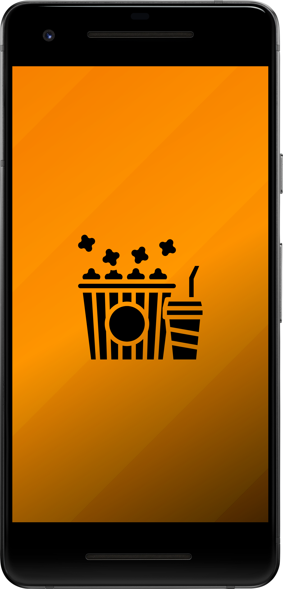
 
 
 ### Movies
 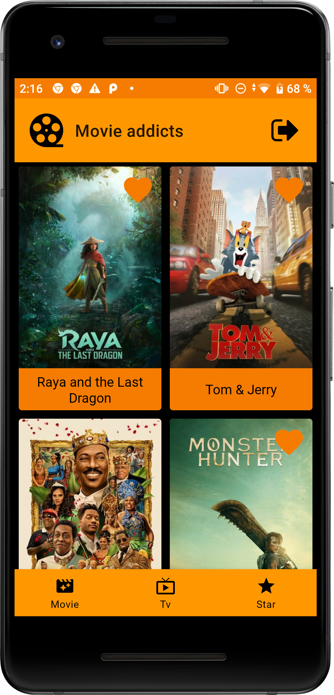
 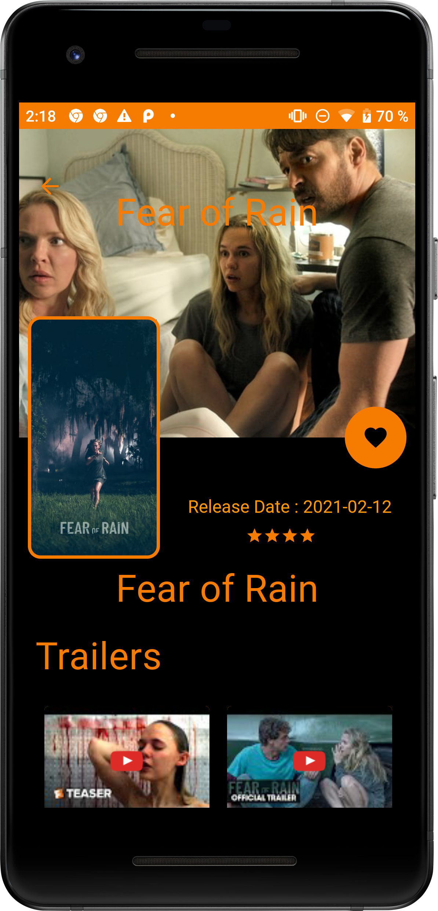
 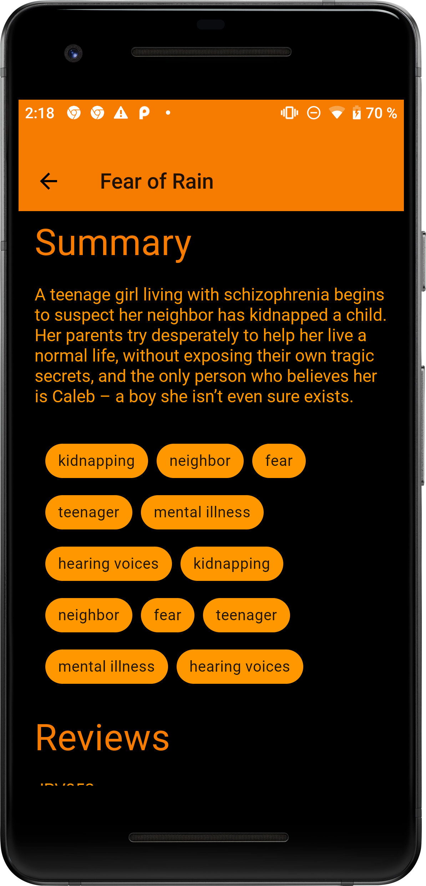
 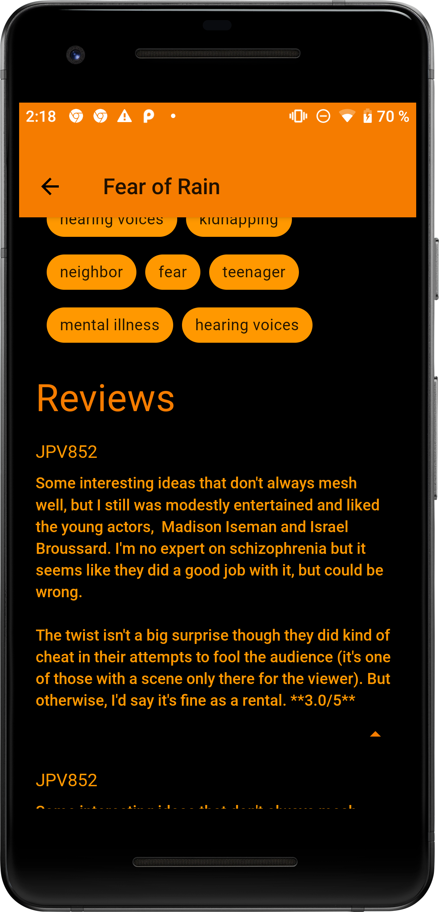
 
### Tv Series
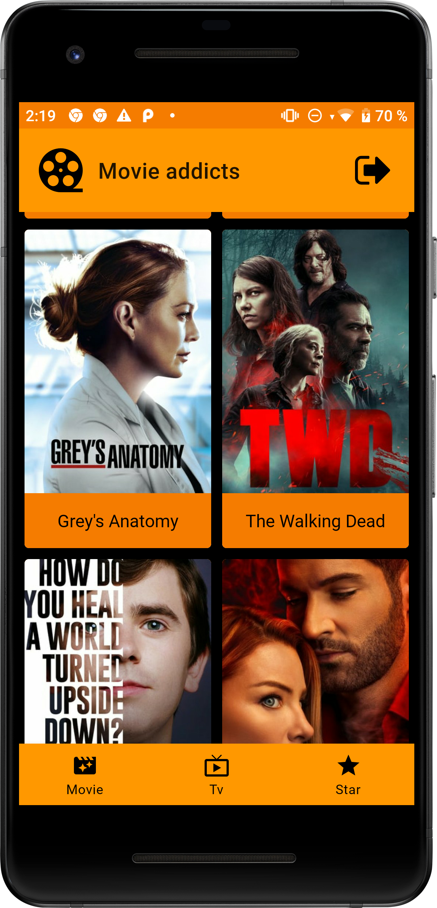

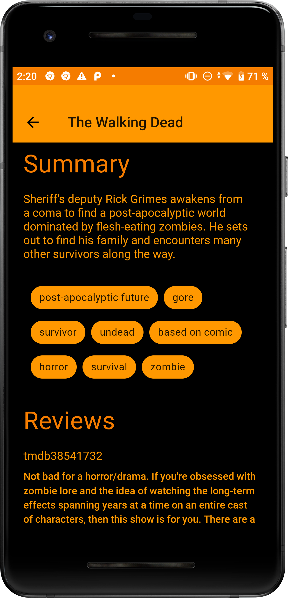
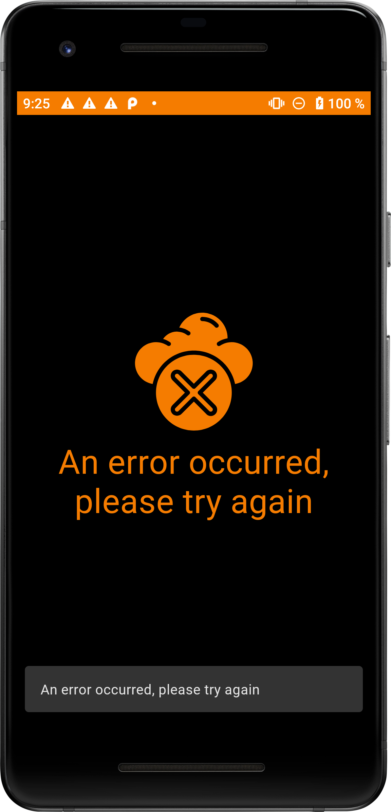
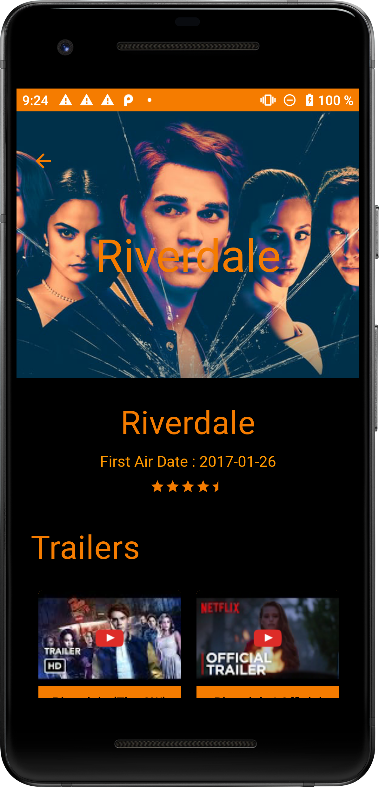

### Stars
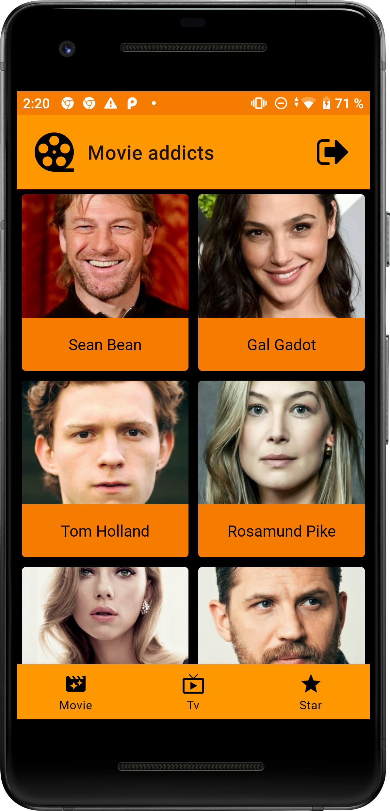
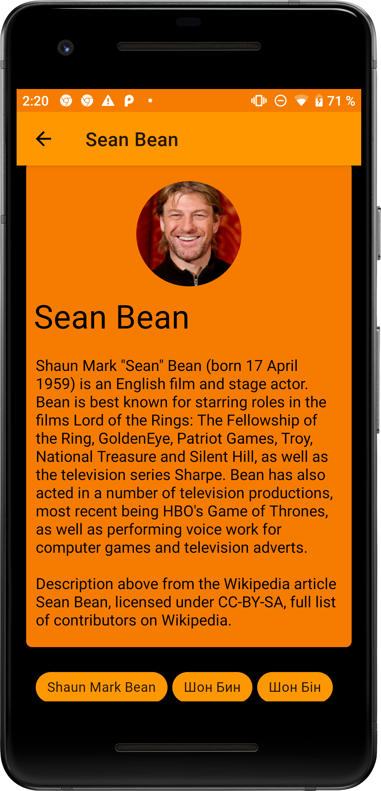

 ## MAD Score

 
